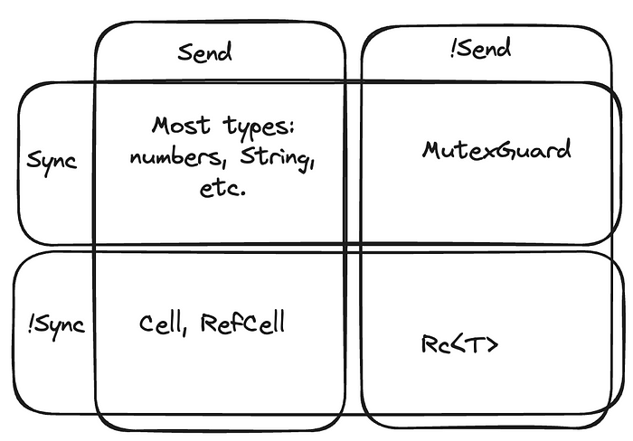
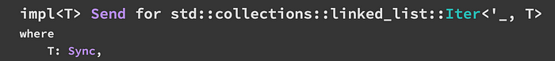
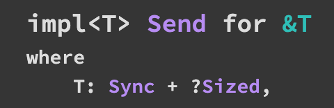
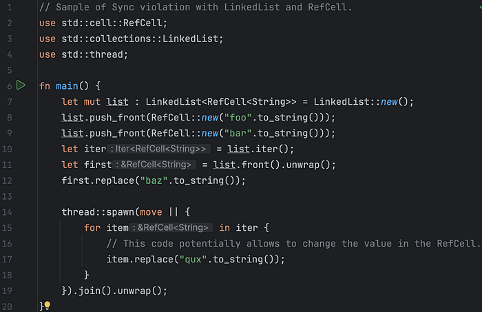
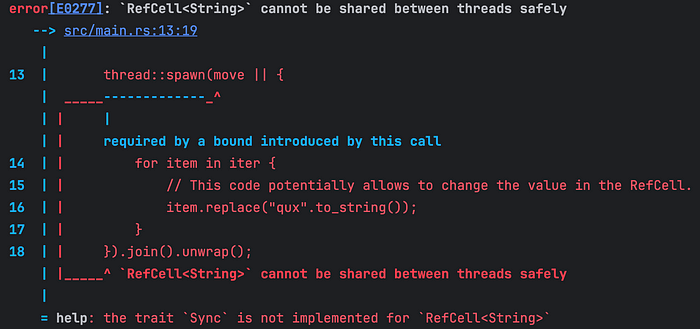
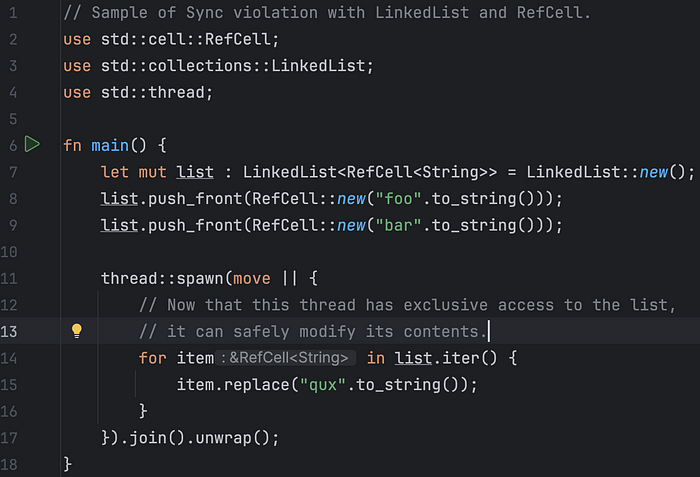

# The definitive guide to Send and Sync traits in Rust

> **Source:** [The definitive guide to Send and Sync traits in Rust | by Enzo Lombardi - Freedium](https://freedium.cfd/https://enzolombardi.net/the-definitive-guide-to-send-and-sync-traits-in-rust-894192e77313)

Rust is this wonderful programming language that has changed my way I approach coding going forward even with regard to other languages, but there is quite a steep learning curve around few topics, the Send and Sync traits being one of these. While there is exhaustive material around this subject by great Rust authors like Jon Gjengset[1][2], Mara Bos[3] and Maxwell Flitton-Caroline Morton [4], I feel I've been constantly left with a lingering question: **while the purpose of the Send trait is very clear, you can't start a thread if you are moving stuff that's not marked as Send, what is the purpose of the Sync trait?** This article will hopefully answer this question in a definitive way. It won't go through all the typical information available on this matter like how to manually mark or un-mark a type for Send/Async or how a closure is related to these markers, since plenty has already been very well written.

So without further ado.

## The Send trait

The Send trait is there to mark types that are safe to be moved, in the sense of giving away the full ownership of it, to other threads. This means that Send types allow to be dropped by a different thread that created them by the merit of their implementation.

Vast majority of types are meant to be safely owned and dropped without side effects from a different thread but there are exceptions like _MutexGuard_ and _Rc<T>._ The default implementation of _MutexGuard_ uses standard OS locks under the cover and for example in Linux a lock must be unlocked by the same thread; since the unlock operation happens during the drop and the drop is performed by the owner of the object, it's clear why _MutexGuard_ is marked as !Send.

For the _Rc<T>_ by looking at the implementation it's clear that it was designed to used only in a single thread execution context. Marking it as !Send prevents such scenarios.

I mention implementation because there's no intrinsic reason for a _MutexGuard_ or _Rc<T>_ to be marked as !Send (indeed Arc<T> it is marked as Send) if not for reasons tied to their internal implementation.

Last but not least, the Send trait is what's required for a closure to be executed on a different thread.

## The Sync trait

The sync trait is there to mark types T for which sharing &T is not safe due to their implementation.

While _MutexGuard<T>_ is !Send it is marked as Sync. This is because a shared reference to a MutexGuard allows you to have read access to the content but it will not allow you to get dropped which requires ownership which requires Send.

An example of traits that are marked as !Sync are the interior mutability ones: _Cell<T>_ and _RefCell<T>_. That's because sharing a shared reference to a Cell/RefCell does indeed allow to mutate the its contents (T) without synchronization.

All four possible combination of these two marker traits are valid like the examples in the table below:

> _All possible combination of Send/!Send and Sync/!Sync are valid_

## The lingering question

So, given that starting a closure requires the Send but not the Sync trait, what's the purpose of the latter?

Enter generics and constraints.

In Rust, like most of other languages with generics support, it is possible to define a generic like:

MyGeneric<T> where T is Sync

This gives the flexibility to whoever is implementing the MyGeneric code to make strong multithreading assumptions with regard to the inner type T.

One such example:

The iterator over a _LinkedList<T>_ is Send only if T is sync. You cannot safely share between threads an iterator over _LinkedList<RefCell<T>>_ but you can safely share an iterator over _LinkedList<MutexGuard<T>>._

Even the connection between Send as Sync, the one that defines that a type _`T`_ _is_ _[`Sync`](https://doc.rust-lang.org/std/marker/trait.Sync.html "trait std::marker::Sync")_ _if and only if_ _`&T`_ _is_ _[`Send`](https://doc.rust-lang.org/std/marker/trait.Send.html "trait std::marker::Send")_is represented in this way:

In practice the following code will not compile:

> _Sample of Sync violation_

Luckily the compiler is very helpful pointing the issue to RefCell<String> not being Sync.

> _Rust compiler being extremely clear_

Notice that it's the _iterator_ to not be shareable as potentially the new thread can simply take ownership of the list without issues. The following compiles fine since the new spun thread has complete ownership of the list and its contained RefCell and modifications to these cells is possible from outside this thread:

> _Ownership implies exclusive access, which is fine_

So there it is, hopefully now it will be clear the role that Sync plays in this picture in order to have a compiler that can prevent data races like in Rust. The combination of Send and Sync together is both necessary and sufficient to express code thread-safety in Rust.

Until the next time.

- [1] Jon Gjengset, [Crust of Rust: Send, Sync, and their implementors](https://www.youtube.com/watch?v=yOezcP-XaIw)
- [2] Jon Gjengset, [Thruough the Fires and the Flames](https://www.youtube.com/watch?v=8-KLX1PGg8Q)
- [3] Mara Bos, [Rust Atomics and Locks: Low-Level Concurrency in Practice](https://www.amazon.com/Rust-Atomics-Locks-Low-Level-Concurrency/dp/1098119444/)
- [4] Maxwell Flitton and Caroline Morton, [Async Rust: Unleashing the Power of Fearless Concurrency](https://www.amazon.com/Async-Rust-Unleashing-Fearless-Concurrency/dp/1098149092)